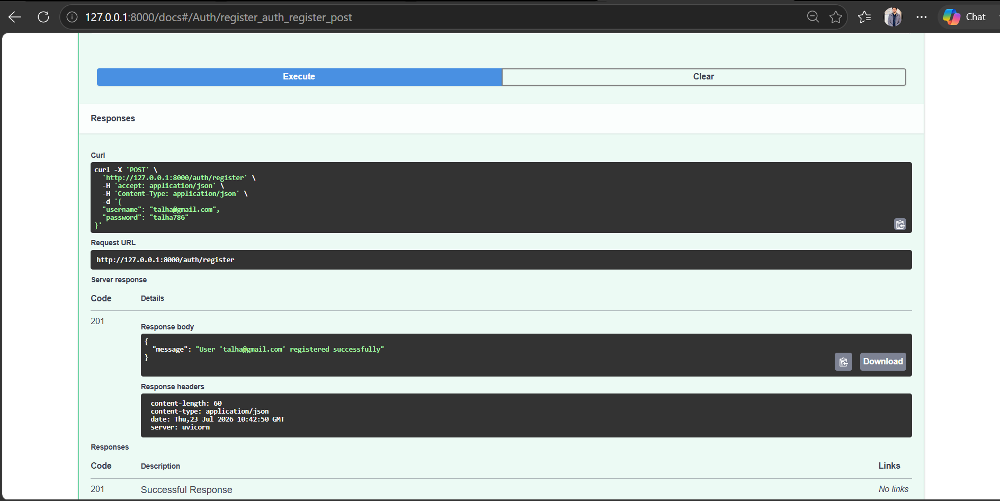
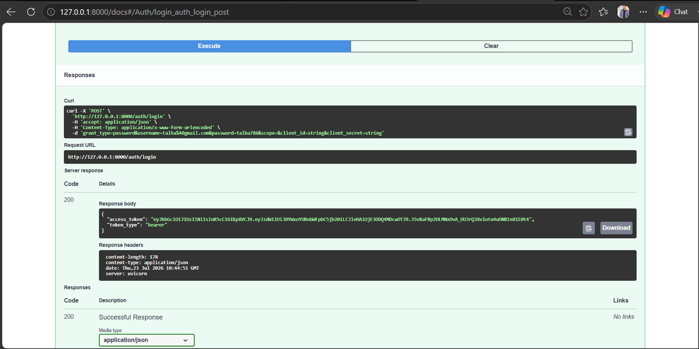
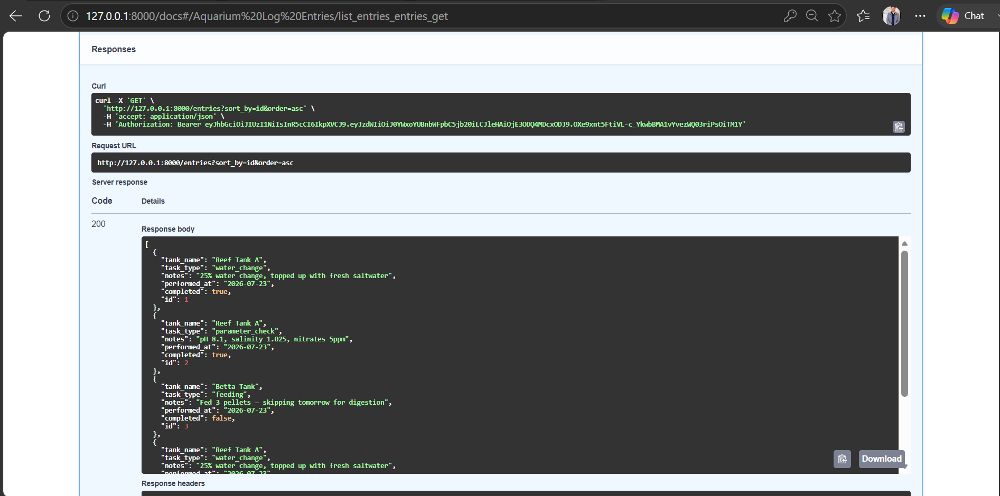
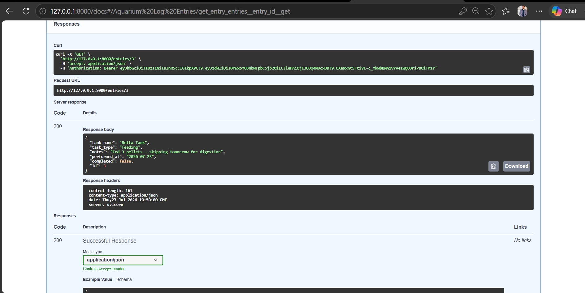
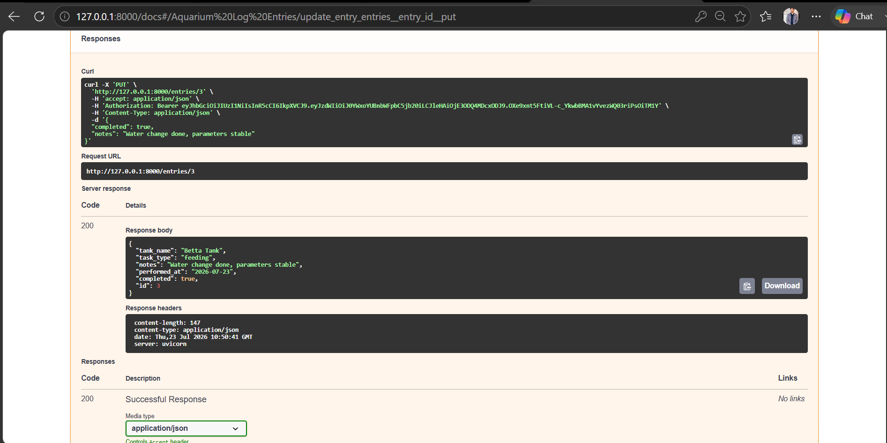
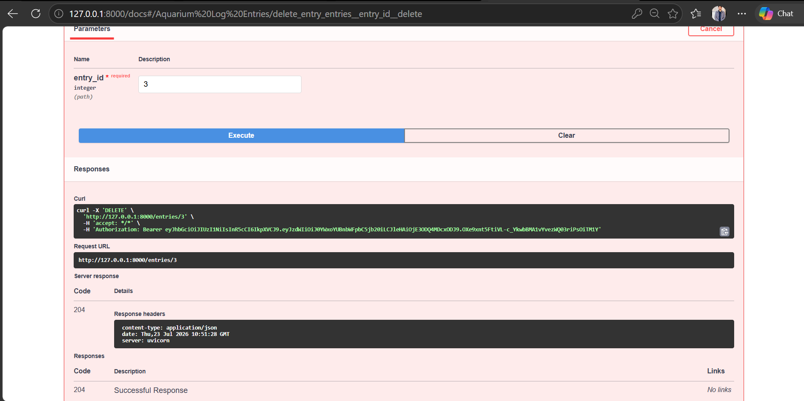
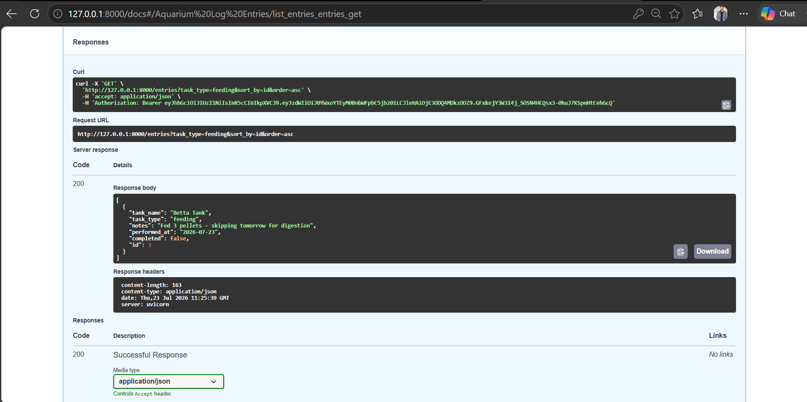

# AquaLog API

A CRUD API for logging and tracking home aquarium maintenance — feedings, water changes, filter cleans, and water-parameter checks. Built with **FastAPI**, JWT authentication, in-memory storage, filterable/sortable listings, and interactive Swagger documentation.

---

## Table of Contents

1. [What This Is](#what-this-is)
2. [Tech Stack](#tech-stack)
3. [Project Structure](#project-structure)
4. [Setup & Installation](#setup--installation)
5. [Environment Variables](#environment-variables)
6. [Running the Server](#running-the-server)
7. [Authentication](#authentication)
8. [API Documentation](#api-documentation)
9. [Rate Limiting](#rate-limiting)
10. [Example Request & Response](#example-request--response)
11. [Screenshots](#screenshots)
12. [Known Limitations](#known-limitations)
13. [Extras / Bonus Features](#extras--bonus-features)

---

## What This Is

AquaLog is a small backend API that manages a list of aquarium maintenance tasks. It supports the four CRUD operations — Create, Read, Update, Delete — on log entries, and demonstrates core backend concepts: HTTP methods, status codes, request validation, JWT-based authentication, and interactive API documentation via Swagger UI.

Data lives entirely in memory (no database yet) and resets whenever the server restarts — this is intentional at this stage of the project.

---

## Tech Stack

| Component | Choice |
|---|---|
| Framework | FastAPI |
| Language | Python 3.13 |
| Auth | JWT (python-jose) + bcrypt password hashing (passlib) |
| Rate limiting | SlowAPI |
| Validation | Pydantic |
| Docs | Swagger UI (built into FastAPI at `/docs`) + ReDoc (`/redoc`) |
| Package manager | uv |
| Storage | In-memory Python data structures (no database) |

---

## Project Structure

```
aqualog-api/
├── app/
│   ├── __init__.py
│   ├── main.py              # FastAPI app instance, wires routers + rate limiter
│   ├── config.py             # Loads SECRET_KEY and JWT settings from .env
│   ├── database.py           # In-memory data store (entries, users) + seed data
│   ├── models.py              # Pydantic request/response schemas
│   ├── auth.py                 # Password hashing, JWT creation/verification
│   ├── rate_limiter.py          # Shared SlowAPI Limiter instance
│   └── routers/
│       ├── __init__.py
│       ├── auth_routes.py        # POST /auth/register, POST /auth/login
│       └── entries.py             # Full CRUD + filtering/sorting + reset
├── docs/                          # Screenshots referenced below
├── requirements.txt
├── .env.example
├── .gitignore
└── README.md
```

---

## Setup & Installation

**Prerequisites:** Python 3.10+ and [uv](https://docs.astral.sh/uv/) installed.

```bash
# 1. Clone the repository
git clone https://github.com/TalhaSaleem01/Aqualog-API.git
cd Aqualog-API

# 2. Install dependencies
uv add -r requirements.txt

# 3. Set up environment variables (see below)
cp .env.example .env
```

---

## Environment Variables

Create a `.env` file in the project root (copy from `.env.example`) with a random secret key:

```
AQUALOG_SECRET_KEY=your-own-long-random-secret-string-here
```

Generate a secure random key with:

```bash
uv run python -c "import secrets; print(secrets.token_hex(32))"
```

`.env` is gitignored and never committed — only `.env.example` (with a placeholder) is tracked in version control.

---

## Running the Server

```bash
uv run uvicorn app.main:app --reload
```

The server starts at `http://127.0.0.1:8000`.

- **Swagger UI (interactive docs):** http://127.0.0.1:8000/docs
- **ReDoc (alternative docs):** http://127.0.0.1:8000/redoc
- **Health check:** http://127.0.0.1:8000/health

---

## Authentication

All `/entries` routes require a valid JWT bearer token. Auth flow:

1. **Register** — `POST /auth/register` with a username and password
2. **Log in** — `POST /auth/login` to receive an access token (valid for 60 minutes)
3. **Authenticate requests** — send the token as a header on every subsequent request:
```
   Authorization: Bearer <your_access_token>
```

In Swagger UI, click the green **Authorize** button at the top of the page and paste `Bearer <your_token>` to unlock the "Try it out" buttons on protected routes.

---

## API Documentation

### Endpoints

| Method | Path | Auth Required | Description |
|---|---|:---:|---|
| GET | `/` | No | API metadata |
| GET | `/health` | No | Health check |
| POST | `/auth/register` | No | Register a new user |
| POST | `/auth/login` | No | Log in and receive a JWT |
| GET | `/entries` | Yes | List all entries (supports filtering & sorting) |
| GET | `/entries/{id}` | Yes | Get a single entry by ID |
| POST | `/entries` | Yes | Create a new entry |
| PUT | `/entries/{id}` | Yes | Update an existing entry |
| DELETE | `/entries/{id}` | Yes | Delete an entry |
| POST | `/entries/reset` | Yes | Reset entries back to seed data |

### Entry Fields

| Field | Type | Notes |
|---|---|---|
| `id` | integer | Auto-assigned, read-only |
| `tank_name` | string | 1–50 characters |
| `task_type` | string | One of: `feeding`, `water_change`, `filter_clean`, `parameter_check` |
| `notes` | string | Optional, up to 300 characters |
| `performed_at` | string | Date the task was performed, e.g. `2026-07-23` |
| `completed` | boolean | Defaults to `false` |

### Query Parameters on `GET /entries`

| Parameter | Values | Purpose |
|---|---|---|
| `tank_name` | any string | Filter by tank name (case-insensitive) |
| `task_type` | `feeding` \| `water_change` \| `filter_clean` \| `parameter_check` | Filter by task type |
| `completed` | `true` \| `false` | Filter by completion status |
| `sort_by` | `id` \| `tank_name` \| `task_type` \| `performed_at` \| `completed` | Field to sort by |
| `order` | `asc` \| `desc` | Sort direction |

Example: `GET /entries?task_type=feeding&sort_by=tank_name&order=desc`

### Status Codes Used

| Code | Meaning | When |
|---|---|---|
| 200 | OK | Successful read/update |
| 201 | Created | Successful entry/user creation |
| 204 | No Content | Successful delete |
| 400 | Bad Request | Invalid or missing fields |
| 401 | Unauthorized | Missing/invalid/expired JWT, or wrong login credentials |
| 404 | Not Found | Entry ID doesn't exist |
| 429 | Too Many Requests | Rate limit exceeded |

---

## Rate Limiting

Implemented with **SlowAPI**, keyed by client IP address, to prevent abuse:

| Endpoint group | Limit |
|---|---|
| `POST /auth/register` | 5 requests / minute |
| `POST /auth/login` | 10 requests / minute |
| `GET /entries`, `GET /entries/{id}` | 30 requests / minute |
| `POST /entries`, `PUT /entries/{id}`, `DELETE /entries/{id}` | 15 requests / minute |
| `POST /entries/reset` | 5 requests / minute |

Exceeding a limit returns a `429 Too Many Requests` response.

---

## Example Request & Response

Tested via PowerShell (`Invoke-WebRequest`, equivalent to `curl -i`):

**Request:** `POST /entries`

```json
{
  "tank_name": "Reef Tank A",
  "task_type": "water_change",
  "notes": "25% water change",
  "performed_at": "2026-07-23",
  "completed": true
}
```

**Response:**

```
HTTP/1.1 201 Created
Content-Length: 133
Content-Type: application/json
Date: Thu, 23 Jul 2026 11:03:26 GMT
Server: uvicorn

{"tank_name":"Reef Tank A","task_type":"water_change","notes":"25% water change","performed_at":"2026-07-23","completed":true,"id":4}
```

---

## Screenshots

### Swagger UI — all endpoints


### Authentication



### Full CRUD Cycle







### Filtering & Sorting (bonus)


---

## Known Limitations

- **No persistent database** — all data is stored in memory and resets whenever the server restarts. This is intentional at this stage of the project (a database is planned for a future iteration).
- **No pagination** — `GET /entries` returns all matching entries at once.
- **Single-role auth** — no admin/user role distinction; any authenticated user can access all entries.

---

## Extras / Bonus Features

Beyond the base CRUD requirement, this project also includes:

- **JWT authentication** — register/login flow with bcrypt-hashed passwords and signed access tokens
- **Filtering & sorting** — query-parameter-based filtering by tank, task type, and completion status, plus sorting by any field
- **Rate limiting** — SlowAPI-based request throttling per endpoint
- **Seed/reset endpoint** — restores example data on demand, useful for demos and re-testing

---

## License

This project was built as part of an internship backend-development assignment.